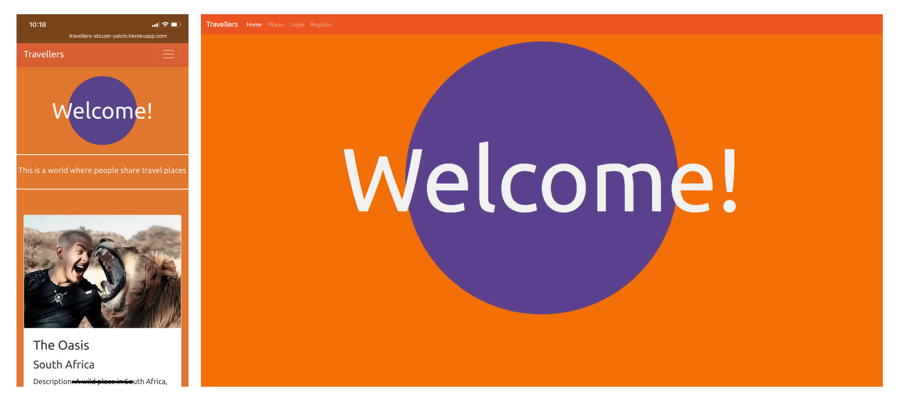
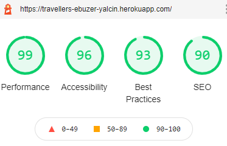

# Testing

## Manual Testing

Manual testing was done throughout the development process. Often when new features were implemented, but also every now and then to make sure whole application was working properly.

### Errors and fixes:
**Card image not displayed**: When user uploaded an image in New Place and Edit Place forms the image name was uploaded to the database but actual image was not showing in created/edited cards. This only happened in Heroku page. Found out that when app was runned from workspace uploaded images was saved to both a specific created folder for uploaded images in the workspace and image name was uploaded to the database. This was not the case for Heroku page. I made a changes in add_place and edit_place app routes in app. py and added request.form.get(). Instead users were asked to insert image url's in New Place and Edit Place forms. After submitting the form image url's were uploaded to the database and were then appearing in created Place cards. 

**Application revealing code**: When writing /logout at the end of the page url, an error page appeared revealing code. This is an important security issue and must be fixed, otherwise the application can be vulnerable. I added an function to logout app route in app. py which try: if there is a session, and if not user gets redirected to login page. Issue was fixed, and the code was not revealed anymore.

**Favicon was throwing an error to console**: Favicon was throwing errors to console telling "GET /profile/static/images/favicon/favicon.ico HTTP/1.1" 404 and "GET /profile/static/images/favicon/site.webmanifest HTTP/1.1" 404 errors. I googled this and found out Favicon links in python needs to look different. By changing favicon links in my base. html page, adding href="{{ url_for('static', filename='/path') }}", I was able to fix these errors. 

**CSS validator throwing an value error**: When validating style.css there was also an overflow: **overlay** style for my Bootstrap cards. Jigsaw validator returned overlay as an false value in the overflow style. While testing overall layout on different browsers I also found out that overlay, which was used for scrolling down in Place cards, was not correctly functioning anyway. Text in the Place cards were overfloating the actual card. Instead of using overlay, a false value, I changed style to overflow: auto. This fixed overfloating text issue. 

### Home Page

Page is responsive, overall buttons and social links are working. User is redirected correctly when clicking on register button. 

### Registration Page

The validation rules for the creation of an account were tested to ensure correct data was sent to the database. As expected, following list was returned as an error:

-   Both or one of the fields missing
-   Username too long or short
-   Password too long or short
-   Username already exists

When form is validated, message appears telling registration was successful. Link below register form to login if user has an account, works. 

### Login Page

When loging in to the application an existing username must be entered together with a correct password. When user login information is not found in the database and user fails to use right username and/or password, a flash message appears. 

When username exists and password is entered right, the login succeeds and the user session is created. Link below login form to register if user don't have an account, works.

### Creating New Entries, Place cards

Following tests have been done. Expected results was returned:

-   Adding an travel card with empty fields does not add a new Place Card
-   Description field, less than 10 over 250 characters cannot be added
-   Image URL must be added
-   Overall every field has its requirements, the application is not letting a new card being created even if one field is not uppfilling its requirements

After successfully creating a new card entries were uploaded to the database as an unique new place card. Profile page and Place page is displaying created card.

### Profile Page

User specific created place cards is listed chronologically 

-   Page is responsive, scroll functionality disappears when page is used on smaller display
-   When clicking the Delete button, card is removed successfully
-   Flash message appears telling card is deleted
-   Database is removing deleted card
-   All card information is correct displaying
-   When clicking on Edit button user gets redirected to Edit Place page.

### Edit Place

When user clicks on the Edit button in a specific card in Profile page, page redirects user to Edit Place page

-   Previously created card can be edited
-   Previously filled inputs is displaying
-   User can choose between editing multiple fields or just one field
-   When submitting flash message appears telling edit was successful
-   When clicking on Cancel user is redirected to Home page, the previous inputs and image remains the same
-   As when creating a whole New Place card, if any field is empty user cannot submit the form

### Places Page

Places page is an marketing page, therefore this page works whether users are logged in or not.

-   As expected, Place cards cannot be edited or deleted from this page
-   Place cards are listed chronologically
-   Place cards is loaded properly from the database, information is correct
-   All users created cards is displaying, different cards from different users.
-   Username is correct showed in "Created by:"
-   Scroll function in cards is properly working

## Responsive Testing

**Iphone 11 display and 1920x1200 monitor**
 
**Lighthouse Desktop Result**

 

**Lighthouse Mobile Result**

 

To be able to use the application in different devices and browsers is important. I made sure the responsiveness of the application was working on various devices and browsers. Testing were also made throughout the project. 

The navbar, cards, layout, buttons and functionalities were tested with different devices and with [Responsive Viewer](https://chrome.google.com/webstore/detail/responsive-viewer/inmopeiepgfljkpkidclfgbgbmfcennb) Chrome extension.

These tests were performed on the following browsers and devices:

-   Chrome, Safari and Firefox on Mac OS, MacBook Air 
-   Chrome, edge and Firefox on Windows, Dell Latitude 5400, 1920x1200 monitor
-   Chrome and Safari on iPhone 11
-   Chrome on Oneplus 7
-   Chrome and Safari on iPhone 7 Plus
-   Chrome on Samsung Galaxy 9
